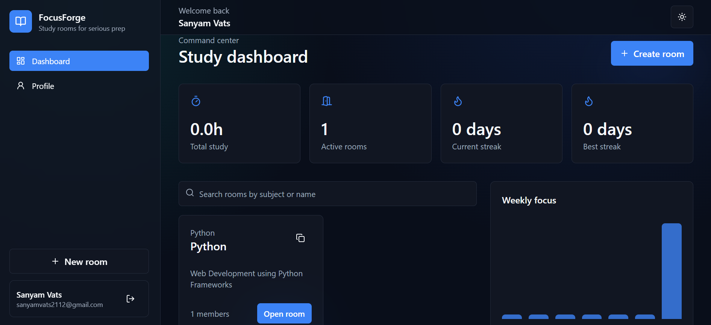
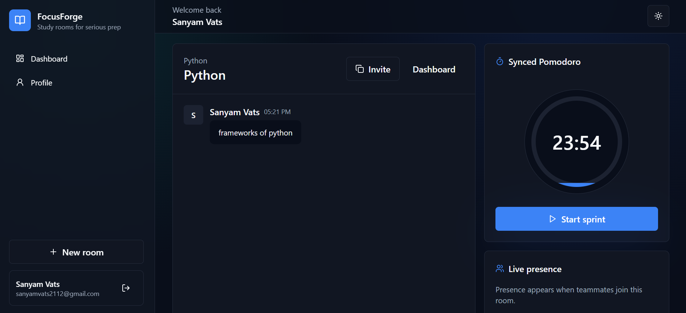

# FocusForge

FocusForge is a production-ready MERN SaaS platform for realtime collaborative study rooms. It is designed for students preparing for exams, interviews, and medical studies who need a serious shared workspace: live presence, room chat, synced Pomodoro sessions, activity history, streaks, and a polished analytics dashboard.




## Why This Project Stands Out

- Full-stack MERN architecture with separated deployable frontend and backend services.
- Realtime Socket.IO collaboration for room presence, chat, typing indicators, notifications, and timer sync.
- Production-aware backend: env configuration, centralized errors, CORS allowlist, Render proxy trust, health checks, rate limiting, Helmet, and modular controllers/services/routes.
- SaaS-quality React UI inspired by Discord, Notion, Linear, and focused study products.
- Deployment-ready for Vercel, Render, and MongoDB Atlas from day one.

## Tech Stack

**Frontend:** React, Vite, TailwindCSS, shadcn-style UI primitives, Framer Motion, Axios, React Router, Socket.IO client  
**Backend:** Node.js, Express.js, MongoDB, Mongoose, JWT, Socket.IO  
**Deployment:** Vercel frontend, Render backend, MongoDB Atlas database

## Core Features

- Register, login, JWT authentication, protected routes, and profile management.
- Create, join, update, and share study rooms with invite links.
- Owner/member room roles with protected membership checks.
- Realtime room chat with typing indicators and join/leave notifications.
- Live room presence powered by Socket.IO.
- Synced Pomodoro sessions with start, pause, resume, end, and session history.
- Dashboard metrics: total study hours, weekly activity, active rooms, recent activity, and streak cards.
- Dark/light mode, responsive layouts, loading skeletons, toast notifications, polished empty states, and smooth motion.

## Architecture

```txt
client (Vercel)
  React + Vite SPA
  Auth context
  Protected routes
  Axios API client using VITE_API_URL
  Socket.IO client using env-derived backend URL

server (Render)
  Express REST API
  Socket.IO realtime gateway
  JWT auth middleware
  Controllers -> Services -> Mongoose models
  Centralized error handling
  MongoDB Atlas persistence
```

Durable state is written through REST services. Realtime state is broadcast through Socket.IO after room membership is verified. The architecture can later add the Socket.IO Redis adapter when horizontal scaling becomes necessary.

## Folder Structure

```txt
FocusForge/
  client/
    src/
      components/
        dashboard/
        layout/
        room/
        ui/
      context/
      hooks/
      lib/
      pages/
  server/
    src/
      config/
      controllers/
      middleware/
      models/
      routes/
      services/
      sockets/
      utils/
```

## Database Design

### User

Stores identity, profile, study goal, and streak metadata.

### StudyRoom

Stores room metadata, invite code, owner, members, roles, and active session reference.

### Message

Stores room chat messages, sender, body, type, read metadata, and timestamps.

### StudySession

Stores Pomodoro/deep-work sessions, owner, room, status, timer state, participants, and timing fields.

### ActivityLog

Stores recruiter-friendly product analytics events such as room creation, joins, and study sessions.

## API Overview

```txt
GET    /health

POST   /api/auth/register
POST   /api/auth/login
GET    /api/auth/me

GET    /api/users/me
PATCH  /api/users/me

GET    /api/rooms
POST   /api/rooms
GET    /api/rooms/:roomId
PATCH  /api/rooms/:roomId
POST   /api/rooms/join/:inviteCode
POST   /api/rooms/:roomId/leave
GET    /api/rooms/:roomId/messages
POST   /api/rooms/:roomId/messages

POST   /api/sessions/:roomId/start
POST   /api/sessions/:sessionId/pause
POST   /api/sessions/:sessionId/resume
POST   /api/sessions/:sessionId/end
GET    /api/sessions/history

GET    /api/dashboard/summary
```

## Socket Events

```txt
room:join
room:leave
room:notification
presence:update
chat:send
chat:new
chat:typing
session:update
```

## Local Setup

### Backend

```bash
cd server
npm install
cp .env.example .env
npm run dev
```

Set `MONGO_URI` and `JWT_SECRET` before using real auth.

### Frontend

```bash
cd client
npm install
cp .env.example .env
npm run dev
```

The frontend expects:

```txt
VITE_API_URL=http://localhost:8080/api
```

## Environment Variables

### Server

```txt
NODE_ENV=production
PORT=8080
MONGO_URI=mongodb+srv://...
JWT_SECRET=long-random-secret
JWT_EXPIRES_IN=7d
CLIENT_URL=https://your-vercel-app.vercel.app
```

### Client

```txt
VITE_API_URL=https://your-render-api.onrender.com/api
```

## Deployment Guide

### MongoDB Atlas

1. Create a cluster.
2. Create a database user.
3. Allow Render outbound access.
4. Copy the connection string into `MONGO_URI`.

### Render Backend

1. Create a new Web Service from this repository.
2. Set root directory to `server`.
3. Build command: `npm ci`.
4. Start command: `npm start`.
5. Add environment variables from `server/.env.example`.
6. Health check path: `/health`.

The included `render.yaml` can also be used as a blueprint.

If Render exits right after `npm start`, check the service environment variables first. In production the backend requires `MONGO_URI` and `JWT_SECRET`, and `CLIENT_URL` should point to your deployed frontend URL. The backend is pinned to Node `20.x` so Render uses the stable LTS runtime instead of a newer experimental major version.

### Vercel Frontend

1. Import the repository into Vercel.
2. Set root directory to `client`.
3. Build command: `npm run build`.
4. Output directory: `dist`.
5. Add `VITE_API_URL=https://your-render-api.onrender.com/api`.

The included `vercel.json` ensures SPA routing works on refresh.

## Scalability Notes

- Add Redis and `@socket.io/redis-adapter` when running multiple backend instances.
- Move activity aggregation to background jobs for larger datasets.
- Add message pagination and cursor-based APIs for large rooms.
- Add room-level RBAC for moderators and invite controls.
- Add file attachments with signed object storage URLs.
- Add observability with structured logs, request IDs, and error monitoring.

## Future Improvements

- Calendar-based study planning.
- AI-generated revision summaries.
- Flashcard decks per room.
- Video/audio study lobbies.
- Admin analytics for cohorts and bootcamps.
- Exportable study reports for mentors.

## Commit Plan

1. `chore: scaffold production MERN monorepo`
2. `feat(api): add auth, rooms, sessions, dashboard, and sockets`
3. `feat(client): build SaaS dashboard and realtime room UI`
4. `chore(deploy): add Vercel Render env examples and README`
5. `test: verify build and production configuration`
